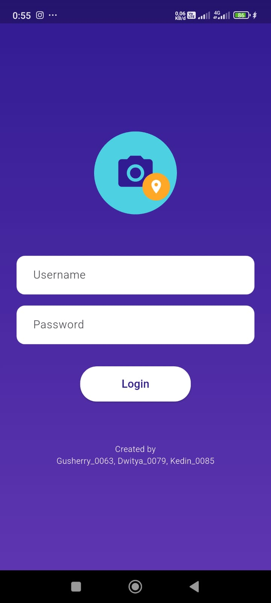
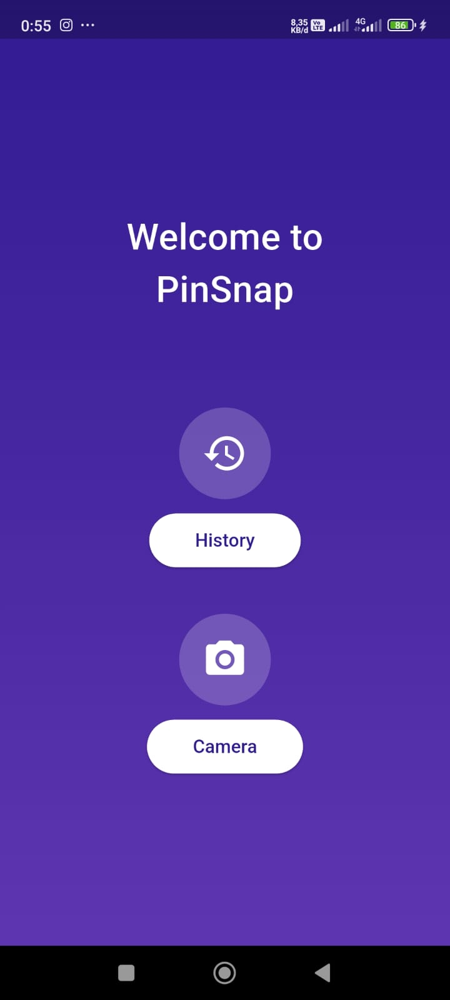
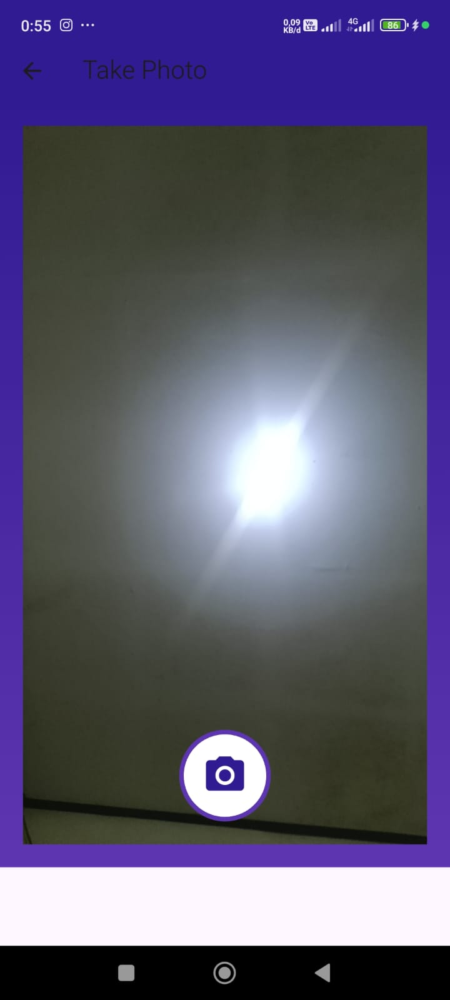
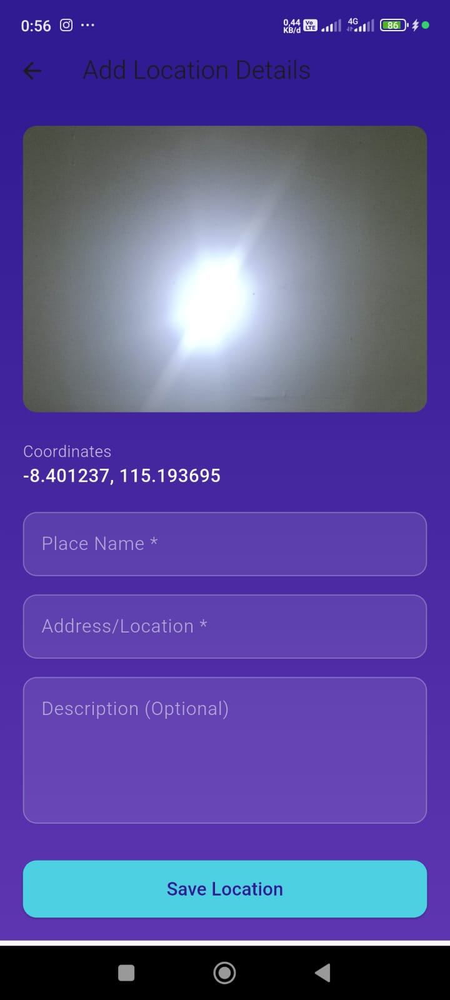
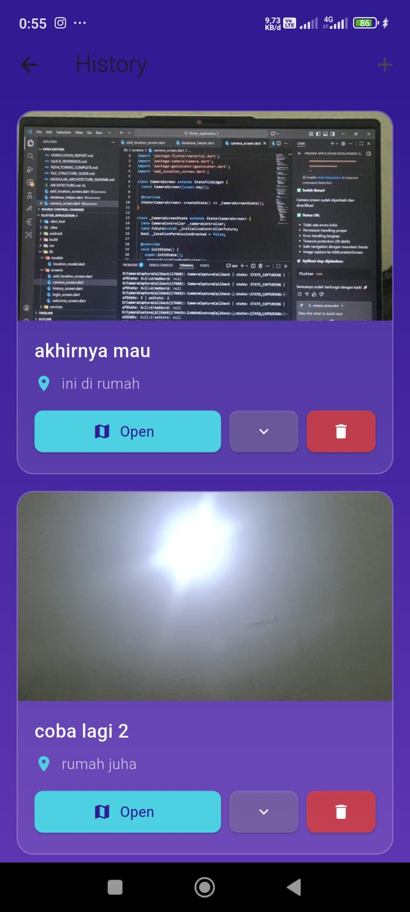
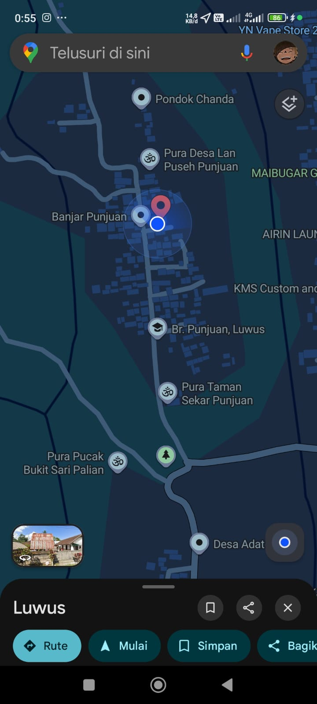

# PinSnap - Location Photo Saver Application

PinSnap adalah aplikasi Android berbasis kamera dan geolokasi yang memungkinkan pengguna menyimpan lokasi-lokasi menarik yang mereka temui secara langsung.

## Deskripsi Aplikasi

Aplikasi ini menggabungkan pengambilan foto dengan pencatatan koordinat GPS secara otomatis, sehingga setiap lokasi yang disimpan memiliki data tempat yang akurat dan autentik.

Pengguna dapat mengambil foto di lokasi tertentu, menambahkan nama tempat, lalu menyimpan lokasi tersebut untuk dibuka kembali kapan saja melalui Google Maps.

## Cara Kerja PinSnap

1. **Pengguna mengambil foto** menggunakan kamera di dalam aplikasi
2. **Sistem secara otomatis menangkap koordinat GPS** sesuai lokasi saat foto diambil
3. **Pengguna menambahkan nama tempat atau keterangan lokasi**
4. **Lokasi disimpan ke dalam menu Saved**
5. **Pengguna dapat membuka kembali lokasi** tersebut melalui Google Maps menggunakan tombol Open

### Catatan Penting

Lokasi hanya dapat disimpan jika pengguna berada langsung di tempat tersebut, sehingga data lokasi bersifat valid dan sesuai kondisi nyata.

---

## Screenshot,

<div>
  
  
  
  
  
  
</div>

---

## link figma https://www.figma.com/design/lmRTXdcEUue2ywIOGUZGQS/-UAS-PM--PinSnap?node-id=0-1&t=L7dePbesdjsN8ShA-1

## Fitur Utama

### 1. Ambil Foto Lokasi

- Menggunakan kamera langsung dari aplikasi
- Interface intuitif dengan tombol shutter yang jelas
- Preview foto sebelum disimpan

### 2. Pin Lokasi Otomatis

- Lokasi diambil dari GPS saat foto diambil
- Koordinat tersimpan secara akurat
- Menampilkan latitude dan longitude

### 3. Tambah Nama Tempat

- Memberi identitas pada setiap lokasi yang disimpan
- Tambah nama tempat, deskripsi detail
- Informasi tersimpan bersama foto

### 4. Saved Location (Riwayat)

- Menampilkan daftar lokasi yang pernah disimpan
- Tampilkan foto thumbnail
- Informasi lengkap lokasi
- Kalender penyimpanan

### 5. Buka di Google Maps

- Navigasi langsung ke lokasi tersimpan
- Integrasi dengan Google Maps
- Dapat menampilkan rute

## Tujuan Aplikasi

PinSnap dibuat untuk membantu pengguna:

- Mengingat lokasi-lokasi menarik yang pernah dikunjungi
- Mencatat perjalanan secara visual dan berbasis lokasi
- Menyimpan referensi tempat tanpa harus menghafal alamat

## Struktur Aplikasi

### Screens (Layar)

1. **Login Screen**

   - Username dan Password
   - Branding aplikasi
   - Design modern dengan gradient

2. **Home Screen**

   - Menu History untuk melihat lokasi tersimpan
   - Menu Camera untuk mengambil foto baru

3. **Camera Screen**

   - Preview kamera real-time
   - Tombol shutter untuk mengambil foto
   - Otomatis mengambil koordinat GPS

4. **Add Location Screen**

   - Menampilkan foto yang diambil
   - Form untuk nama tempat
   - Form untuk lokasi
   - Form untuk deskripsi
   - Tombol Save dan Back

5. **History Screen**
   - List lokasi yang tersimpan
   - Expandable card untuk melihat detail
   - Tombol Open (Google Maps)
   - Tombol Delete
   - Tombol Add untuk menambah lokasi baru

## Persyaratan Sistem

### Dependencies

- **flutter**: ^3.9.2
- **camera**: ^0.10.5 - Akses kamera perangkat
- **geolocator**: ^9.0.2 - Akses GPS/Location
- **google_maps_flutter**: ^2.5.0 - Integrasi Google Maps
- **image_picker**: ^1.0.4 - Pemilihan gambar
- **path_provider**: ^2.1.1 - Manajemen file path
- **sqflite**: ^2.3.0 - Database lokal SQLite
- **intl**: ^0.19.0 - Format tanggal/waktu
- **url_launcher**: ^6.2.0 - Buka URL eksternal

### Permissions

#### Android

- `CAMERA` - Untuk mengakses kamera
- `ACCESS_FINE_LOCATION` - Untuk akses GPS presisi tinggi
- `ACCESS_COARSE_LOCATION` - Untuk akses lokasi umum

#### iOS

- `NSCameraUsageDescription` - Permintaan akses kamera
- `NSLocationWhenInUseUsageDescription` - Permintaan akses lokasi
- `NSLocationAlwaysAndWhenInUseUsageDescription` - Permintaan akses lokasi lengkap

## Instalasi

### 1. Clone Repository

```bash
git clone <repository-url>
cd flutter_application_1
```

### 2. Install Dependencies

```bash
flutter pub get
```

### 3. Setup Android

```bash
cd android
./gradlew clean
cd ..
```

### 4. Setup iOS (macOS only)

```bash
cd ios
pod install
cd ..
```

### 5. Run Application

```bash
flutter run
```

## Database

Aplikasi menggunakan SQLite untuk menyimpan data lokasi. Schema tabel:

```sql
CREATE TABLE locations(
  id INTEGER PRIMARY KEY,
  placeName TEXT,
  location TEXT,
  description TEXT,
  latitude REAL,
  longitude REAL,
  imagePath TEXT,
  timestamp TEXT
)
```

## Model Data

### LocationModel

```dart
class LocationModel {
  int? id;
  String placeName;      // Nama tempat
  String location;       // Lokasi/Alamat
  String description;    // Deskripsi
  double latitude;       // Garis lintang
  double longitude;      // Garis bujur
  String imagePath;      // Path file foto
  String timestamp;      // Waktu penyimpanan
}
```

## Navigasi Aplikasi

```
Login Screen
    ↓
Home Screen
    ├→ History Screen
    │     ├→ Location Detail (Expand)
    │     ├→ Open in Maps
    │     └→ Delete Location
    │
    └→ Camera Screen
         ├→ Take Photo
         └→ Add Location Screen
              ├→ Add Details
              └→ Save Location
```

## Fitur Keamanan

- Login sederhana (dapat dikembangkan dengan Firebase Auth)
- Permintaan permission untuk camera dan location
- Validasi input form sebelum penyimpanan
- Konfirmasi delete sebelum menghapus lokasi

## Design

### Color Scheme

- **Primary**: Deep Purple (#6A1B9A)
- **Secondary**: Cyan (#00BCD4)
- **Accent**: Orange
- **Background**: Gradient Purple

### Typography

- Clean and modern
- Material Design 3 compliant
- Responsive untuk berbagai ukuran layar

## Screenshot

### Login Screen

- Logo aplikasi dengan ikon kamera dan lokasi
- Form username dan password
- Tombol login dengan design modern

### Home Screen

- Judul "Welcome to PinSnap"
- Menu History (dengan ikon clock)
- Menu Camera (dengan ikon camera)

### Camera Screen

- Preview kamera real-time
- Tombol shutter bulat di bawah

### History Screen

- List card dengan foto thumbnail
- Info: Nama tempat, lokasi, deskripsi
- Tombol: Open (Maps), Expand (Detail), Delete

## Troubleshooting

### Camera Permission Denied

- Pastikan aplikasi memiliki permission kamera di setting
- Restart aplikasi

### GPS Not Working

- Pastikan GPS diaktifkan di perangkat
- Periksa permission lokasi di setting
- Tunggu beberapa detik untuk signal GPS lock

### Database Error

- Hapus aplikasi dan install ulang
- Atau clear app data di setting

## Pengembangan Selanjutnya

- Integrasi Firebase untuk cloud backup
- Sharing lokasi dengan user lain
- Social features (like, comment)
- Filter dan search lokasi
- Offline maps support
- Dark mode
- Multiple language support

## Contributor

- Gusherry_0063
- Dwitya_0079
- Kedin_0085

## License

MIT License

---

**Version**: 1.0.0  
**Last Updated**: 2026
